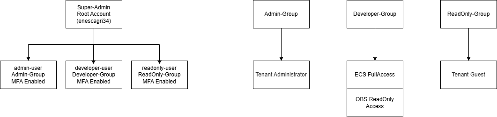

# Huawei Cloud IAM Homework

Bu repo, Huawei Cloud IAM konusu kapsamında hazırlanmış uygulamalı ödev çalışmasını içermektedir.

## Amaç

Bu çalışmanın amacı, Huawei Cloud üzerinde temel bir IAM yapısı kurarak farklı yetki seviyelerine sahip kullanıcılar oluşturmak, bu kullanıcılara uygun policy atamaları yapmak ve MFA ile hesap güvenliğini güçlendirmektir.

Bu ödev kapsamında aşağıdaki işlemler yapılmıştır:

- Admin, Developer ve ReadOnly olmak üzere üç farklı IAM grubu oluşturuldu.
- Her grup için ayrı IAM kullanıcıları oluşturuldu.
- Kullanıcılar ilgili gruplara eklendi.
- Gruplara uygun policy atamaları yapıldı.
- Admin kullanıcısı için MFA etkinleştirildi.
- MFA ile başarılı giriş testi gerçekleştirildi.
- IAM mimarisi draw.io ile görselleştirildi.
- Yapılan işlemler ekran görüntüleriyle belgelendi.

---

## Kullanılan Teknolojiler ve Servisler

Bu çalışmada aşağıdaki servisler ve araçlar kullanılmıştır:

- Huawei Cloud
- Identity and Access Management, yani IAM
- IAM User Groups
- IAM Users
- IAM Policies
- Multi-Factor Authentication, yani MFA
- draw.io / diagrams.net
- GitHub

---

## Oluşturulan IAM Yapısı

Ödev kapsamında üç farklı kullanıcı grubu oluşturulmuştur:

```text
Huawei Cloud Root Account
│
├── Admin-Group
│   └── admin-user
│
├── Developer-Group
│   └── developer-user
│
└── ReadOnly-Group
    └── readonly-user
```

Bu yapı sayesinde kullanıcılar doğrudan tek tek yetkilendirilmek yerine, gruplar üzerinden yönetilmiştir.

---

## IAM Grupları

| Grup Adı | Amaç |
|---|---|
| Admin-Group | Huawei Cloud kaynaklarını yönetmek için oluşturulan yönetici grubudur. |
| Developer-Group | Geliştirme ve test işlemleri için sınırlı yetkilere sahip kullanıcı grubudur. |
| ReadOnly-Group | Cloud kaynaklarını sadece görüntülemek için oluşturulan kullanıcı grubudur. |

---

## IAM Kullanıcıları

| Kullanıcı Adı | Bağlı Olduğu Grup | Amaç |
|---|---|---|
| admin-user | Admin-Group | Yönetimsel işlemleri gerçekleştirmek için oluşturuldu. |
| developer-user | Developer-Group | Geliştirme ve test işlemleri için oluşturuldu. |
| readonly-user | ReadOnly-Group | Kaynakları sadece görüntülemek için oluşturuldu. |

---

## Policy Atamaları

Gruplara, görevlerine uygun olacak şekilde policy atamaları yapılmıştır.

| Grup | Yetki Mantığı |
|---|---|
| Admin-Group | Yönetimsel işlemler için geniş yetki |
| Developer-Group | Geliştirme/test kaynakları için sınırlı yetki |
| ReadOnly-Group | Sadece görüntüleme yetkisi |

Bu yapı ile kullanıcıların görevleri dışında kalan kaynaklara gereksiz erişim sağlaması engellenmiştir.

---

## Uygulanan Güvenlik Prensipleri

Bu çalışmada temel IAM güvenlik prensipleri uygulanmıştır.

### Least Privilege

Kullanıcılara sadece görevlerini yerine getirebilmeleri için gerekli olan yetkiler verilmiştir.

Örneğin, ReadOnly kullanıcısına kaynakları değiştirme veya silme yetkisi verilmemiştir.

### MFA Kullanımı

Kullanıcı hesaplarında MFA etkinleştirilmiştir.

MFA sayesinde, sadece kullanıcı adı ve şifre yeterli olmamakta; ek bir doğrulama faktörü de gerekmektedir.

### Root Hesabın Korunması

Root hesabın günlük işlemlerde kullanılmaması prensibi benimsenmiştir.

Günlük işlemler için ayrı IAM kullanıcıları oluşturulmuştur.

### Grup Tabanlı Yetki Yönetimi

Yetkiler doğrudan kullanıcılara değil, kullanıcı gruplarına atanmıştır.

Bu sayede yönetim daha düzenli ve sürdürülebilir hale getirilmiştir.

### Görev Ayrımı

Admin, Developer ve ReadOnly rolleri ayrı gruplar altında yapılandırılmıştır.

Bu sayede her kullanıcının görev alanı net olarak ayrılmıştır.

---

## IAM Architecture Diagram

Aşağıda oluşturulan IAM mimarisi gösterilmiştir:



---

## Ekran Görüntüleri

Bu çalışmada kullanıcı oluşturma, grup oluşturma, policy atama ve MFA doğrulama adımları ekran görüntüleriyle belgelenmiştir.

Ekran görüntüleri `screenshots` klasörü içerisinde yer almaktadır.

---

## Repo Yapısı

```text
.
├── README.md
├── report.md
├── diagrams/
│   └── iam-architecture-diagram.png
└── screenshots/
    ├── 01-admin-group-created.png
    ├── 02-developer-group-created.png
    ├── 03-readonly-group-created.png
    ├── 04-admin-group-policy-assignment.png
    ├── 05-developer-group-policy-assignment.png
    ├── 06-readonly-group-policy-assignment.png
    ├── 07-admin-user-created.png
    ├── 08-developer-user-created.png
    ├── 09-readonly-user-created.png
    ├── 10-iam-users-list.png
    ├── 11-admin-user-mfa-enabled.png
    ├── 12-developer-user-mfa-enabled.png
    ├── 13-readonly-user-mfa-enabled.png
    └── 14-successful-login-with-mfa.png
```

---

## Güvenlik Notu

Ekran görüntülerinde yer alan hassas bilgiler gizlenmiştir.

Paylaşılmaması gereken bilgiler:

- Access Key
- Secret Key
- MFA QR kodu
- MFA secret
- Recovery code
- Telefon numarası
- E-posta adresi
- Account ID
- Domain ID
- Şifre bilgileri

Bu bilgiler güvenlik nedeniyle repoya eklenmemiştir.

---

## Sonuç

Bu çalışma ile Huawei Cloud üzerinde temel bir IAM yapısı kurulmuştur.

Admin, Developer ve ReadOnly olmak üzere üç farklı yetki seviyesi oluşturulmuş, kullanıcılar ilgili gruplara atanmış ve MFA ile hesap güvenliği artırılmıştır.

Bu yapı sayesinde:

- Kullanıcılar ayrı kimliklerle temsil edilmiştir.
- Yetkiler gruplar üzerinden yönetilmiştir.
- En az yetki prensibi uygulanmıştır.
- MFA ile giriş güvenliği güçlendirilmiştir.
- IAM mimarisi diagram ile görselleştirilmiştir.

Bu çalışma, bulut ortamlarında kimlik ve erişim yönetiminin güvenli bir şekilde nasıl yapılandırılabileceğini göstermektedir.