# Huawei Cloud IAM Homework Report

## 1. Giriş

Bu rapor, Huawei Cloud üzerinde gerçekleştirilen IAM uygulama ödevini belgelemek amacıyla hazırlanmıştır.

Ödev kapsamında Huawei Cloud üzerinde farklı yetki seviyelerine sahip IAM kullanıcıları ve kullanıcı grupları oluşturulmuş, bu gruplara uygun policy atamaları yapılmış ve kullanıcı hesapları MFA ile güvence altına alınmıştır.

Çalışmanın temel amacı, IAM yapısının sadece teorik olarak değil, pratik olarak da nasıl kurulacağını görmek ve bulut ortamlarında güvenli erişim yönetiminin temel prensiplerini uygulamaktır.

---

## 2. Çalışmanın Amacı

Bu ödevin temel amaçları şunlardır:

- Huawei Cloud üzerinde IAM kullanıcıları oluşturmak
- Kullanıcıları görevlerine göre gruplara ayırmak
- Gruplara uygun policy atamaları yapmak
- Admin, Developer ve ReadOnly olmak üzere üç farklı erişim seviyesi oluşturmak
- MFA kullanarak hesap güvenliğini artırmak
- Root hesabın günlük işlemlerde kullanılmaması prensibini uygulamak
- IAM mimarisini diagram ile görselleştirmek
- Yapılan işlemleri ekran görüntüleriyle belgelemek

Bu çalışma, bulut güvenliğinde kimlik ve erişim yönetiminin ne kadar önemli olduğunu göstermektedir.

---

## 3. Kullanılan Servisler ve Araçlar

Bu çalışmada aşağıdaki servisler ve araçlar kullanılmıştır:

| Servis / Araç | Kullanım Amacı |
|---|---|
| Huawei Cloud | Cloud ortamı |
| IAM | Kimlik ve erişim yönetimi |
| IAM User Groups | Kullanıcıları gruplandırma |
| IAM Users | Kullanıcı hesapları oluşturma |
| IAM Policies | Yetki atama |
| MFA | Ek kimlik doğrulama güvenliği |
| draw.io / diagrams.net | IAM mimarisini çizme |
| GitHub | Çalışmayı dokümante etme ve paylaşma |

---

## 4. IAM Nedir?

IAM, yani **Identity and Access Management**, Türkçesiyle **Kimlik ve Erişim Yönetimi**, cloud ortamlarında kullanıcıların kimliklerini ve erişim yetkilerini yönetmek için kullanılan temel güvenlik servisidir.

IAM şu sorulara cevap verir:

```text
Kim giriş yapabilir?
Kim hangi kaynağa erişebilir?
Kim hangi işlemi yapabilir?
Kim sadece görüntüleyebilir?
Kim kaynak oluşturabilir?
Kim kaynak silebilir?
```

Bulut ortamlarında fiziksel sınırlar yerine dijital kimlikler ön plana çıkar. Bu nedenle IAM, cloud güvenliğinin merkezinde yer alır.

---

## 5. Root Account ve IAM User Farkı

Huawei Cloud hesabı oluşturulduğunda bir ana hesap, yani root account oluşur.

Root account, tüm cloud kaynakları ve faturalandırma üzerinde en yüksek yetkiye sahiptir. Bu nedenle günlük işlemlerde kullanılmamalıdır.

Bu çalışmada günlük işlemler için ayrı IAM kullanıcıları oluşturulmuştur.

| Hesap Türü | Açıklama |
|---|---|
| Root Account | En yüksek yetkiye sahip ana hesaptır. Sadece kritik işlemler için kullanılmalıdır. |
| IAM User | Belirli kişiler veya roller için oluşturulan sınırlı yetkili kullanıcı hesaplarıdır. |

Bu yaklaşım, güvenlik açısından daha doğru bir yapıdır çünkü her kullanıcının yetkisi ihtiyacına göre sınırlandırılabilir.

---

## 6. Oluşturulan IAM Yapısı

Ödev kapsamında üç farklı IAM kullanıcı grubu oluşturulmuştur:

```text
Huawei Cloud Root Account
│
├── Admin-Group
│   └── admin-user
│
├── Developer-Group
│   └── developer-user
│
└── ReadOnly-Group
    └── readonly-user
```

Bu yapı sayesinde kullanıcılar doğrudan tek tek yetkilendirilmek yerine, gruplar üzerinden yönetilmiştir.

---

## 7. IAM Grupları

### 7.1 Admin-Group

`Admin-Group`, yönetimsel işlemleri gerçekleştirmek için oluşturulmuştur.

Bu grup, Huawei Cloud kaynaklarını yönetmek için geniş yetkilere sahiptir.

Bu gruba bağlı kullanıcı:

```text
admin-user
```

Bu grup, günlük yönetim işlemlerinde root hesabın kullanılmasını engellemek için oluşturulmuştur.

---

### 7.2 Developer-Group

`Developer-Group`, geliştirme ve test işlemleri için oluşturulmuştur.

Bu gruba bağlı kullanıcı:

```text
developer-user
```

Developer kullanıcısına, geliştirme ve test işlemleri için gerekli olan sınırlı yetkiler atanmıştır.

Bu kullanıcıya billing, IAM yönetimi veya root seviyesinde kritik yetkiler verilmemiştir.

---

### 7.3 ReadOnly-Group

`ReadOnly-Group`, cloud kaynaklarını sadece görüntülemek için oluşturulmuştur.

Bu gruba bağlı kullanıcı:

```text
readonly-user
```

Bu kullanıcı kaynakları görebilir ancak değiştirme, silme veya yeni kaynak oluşturma işlemleri yapamaz.

ReadOnly rolü özellikle denetim, izleme ve gözlemleme işlemleri için uygundur.

---

## 8. Oluşturulan IAM Kullanıcıları

| Kullanıcı Adı | Bağlı Olduğu Grup | Amaç |
|---|---|---|
| admin-user | Admin-Group | Yönetimsel işlemler için oluşturuldu. |
| developer-user | Developer-Group | Geliştirme ve test işlemleri için oluşturuldu. |
| readonly-user | ReadOnly-Group | Kaynakları sadece görüntülemek için oluşturuldu. |

Her kullanıcı ayrı bir dijital kimliği temsil eder. Böylece tüm ekip üyelerinin aynı root hesabı kullanması yerine, her kullanıcı kendi hesabı üzerinden işlem yapar.

Bu yapı sayesinde işlem takibi ve güvenlik yönetimi daha düzenli hale gelir.

---

## 9. Policy Atamaları

IAM policy, kullanıcıların veya grupların hangi işlemleri yapabileceğini belirleyen yetki paketidir.

Bu çalışmada policy atamaları kullanıcılar yerine gruplar üzerinden yapılmıştır.

| Grup | Yetki Mantığı | Açıklama |
|---|---|---|
| Admin-Group | Yönetimsel yetki | Cloud kaynaklarını yönetmek için kullanılır. |
| Developer-Group | Sınırlı geliştirme yetkisi | Geliştirme ve test işlemleri için kullanılır. |
| ReadOnly-Group | Sadece görüntüleme yetkisi | Kaynakları değiştirmeden görüntülemek için kullanılır. |

Bu yapı, **least privilege**, yani **en az yetki prensibi** ile uyumludur.

---

## 10. Least Privilege Prensibi

Bu çalışmada uygulanan en önemli güvenlik prensiplerinden biri **least privilege** prensibidir.

Least privilege şu anlama gelir:

> Kullanıcıya sadece işini yapması için gereken minimum yetki verilmelidir.

Bu prensip sayesinde:

- Kullanıcılar gereksiz kaynaklara erişemez.
- Hatalı işlem riski azalır.
- Hesap ele geçirilirse oluşabilecek zarar sınırlanır.
- Yetki yönetimi daha kontrollü hale gelir.

Örneğin `readonly-user` kullanıcısı sadece kaynakları görüntüleyebilir. Kaynak oluşturma, silme veya değiştirme yetkisine sahip değildir.

Benzer şekilde `developer-user`, geliştirme ve test işlemleri için oluşturulmuştur. Bu kullanıcıya root seviyesinde yönetim veya faturalandırma yetkisi verilmemiştir.

---

## 11. MFA Yapılandırması

MFA, yani **Multi-Factor Authentication**, Türkçesiyle **Çok Faktörlü Kimlik Doğrulama**, hesaba giriş sırasında ikinci bir doğrulama katmanı ekler.

Normal girişte kullanıcı adı ve şifre kullanılır. MFA etkinleştirildiğinde buna ek olarak ikinci bir doğrulama faktörü gerekir.

Örneğin:

```text
Kullanıcı adı + şifre + MFA kodu
```

Bu çalışmada IAM kullanıcıları için MFA etkinleştirilmiştir.

MFA sayesinde, kullanıcı şifresi ele geçirilse bile saldırganın hesaba giriş yapması zorlaşır.

---

## 12. MFA Kullanımının Önemi

Cloud hesapları kritik kaynaklara erişim sağlar. Bir cloud hesabı ele geçirilirse saldırgan şu işlemleri yapabilir:

```text
Sunucu oluşturabilir.
Sunucu silebilir.
Security Group kurallarını değiştirebilir.
Veritabanlarına erişebilir.
OBS dosyalarını okuyabilir veya silebilir.
Yeni access key oluşturabilir.
Fatura maliyetini artırabilir.
```

Bu yüzden MFA, cloud hesapları için çok önemli bir güvenlik önlemidir.

Bu çalışmada MFA kullanılarak hesap güvenliği artırılmıştır.

---

## 13. IAM Architecture Diagram

Aşağıda ödev kapsamında oluşturulan IAM mimarisi gösterilmiştir:


Bu diagramda root account, kullanıcı grupları, IAM kullanıcıları, policy atamaları ve MFA durumu görselleştirilmiştir.

---

## 14. Yapılan İşlemler

Bu çalışma kapsamında aşağıdaki adımlar uygulanmıştır:

1. Huawei Cloud IAM ekranına giriş yapıldı.
2. `Admin-Group` oluşturuldu.
3. `Developer-Group` oluşturuldu.
4. `ReadOnly-Group` oluşturuldu.
5. Her gruba uygun policy atamaları yapıldı.
6. `admin-user` oluşturuldu.
7. `developer-user` oluşturuldu.
8. `readonly-user` oluşturuldu.
9. Kullanıcılar ilgili gruplara eklendi.
10. Admin kullanıcısı için MFA etkinleştirildi.
11. MFA ile başarılı login testi gerçekleştirildi.
12. IAM mimarisi draw.io ile çizildi.
13. Tüm işlemler ekran görüntüleriyle belgelendi.

---

## 15. Ekran Görüntüleri

Bu bölümde yapılan işlemlere ait ekran görüntüleri yer almaktadır.

> Not: Ekran görüntülerindeki hassas bilgiler gizlenmiştir.

### 15.1 Admin Group Oluşturma

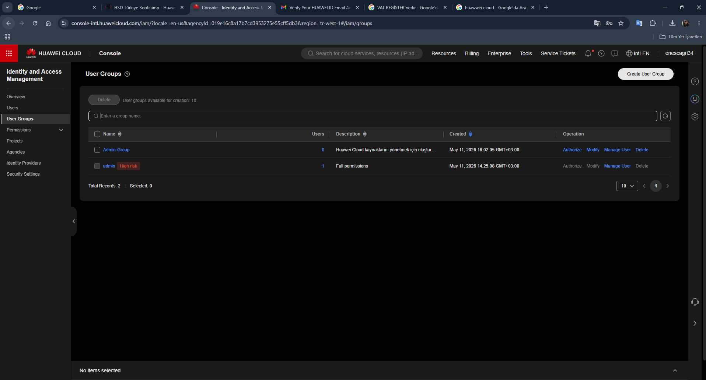

---

### 15.2 Developer Group Oluşturma

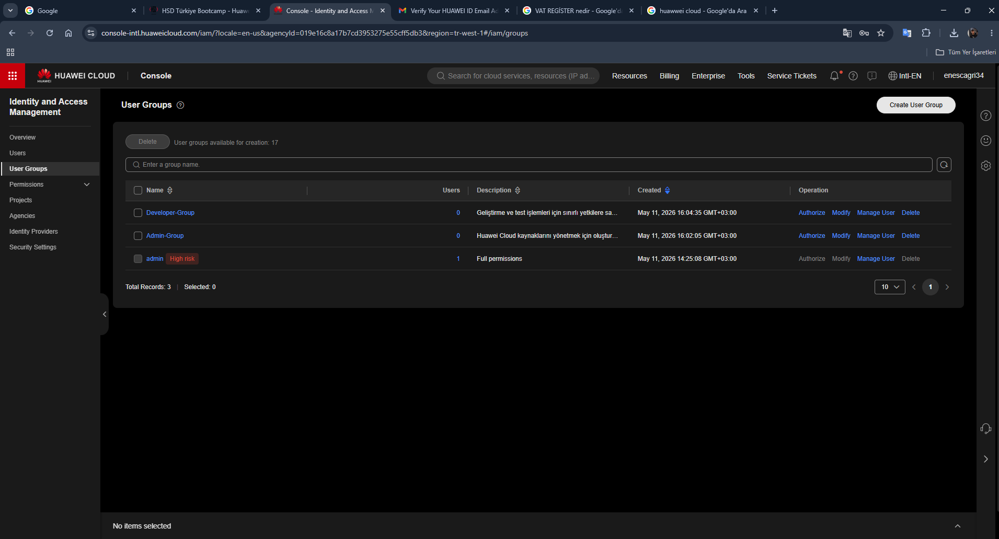

---

### 15.3 ReadOnly Group Oluşturma

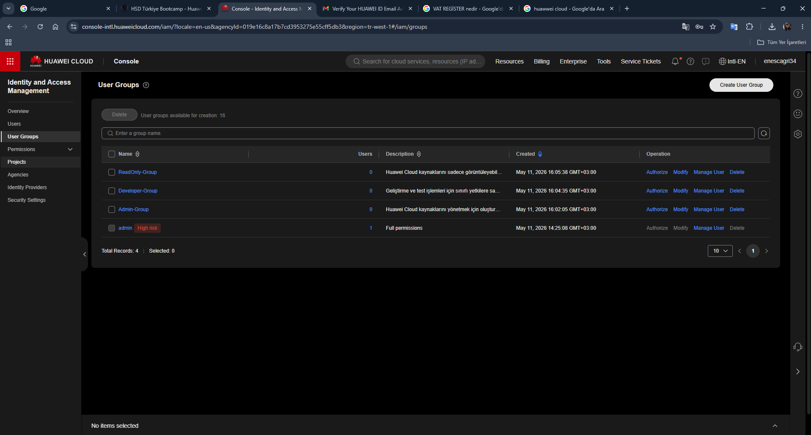

---

### 15.4 Admin Group Policy Assignment

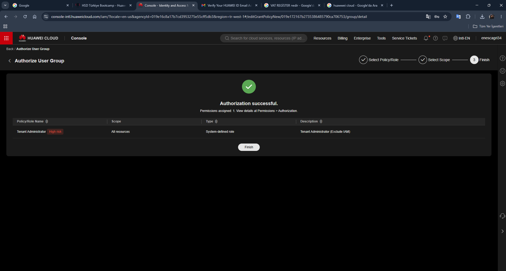

---

### 15.5 Developer Group Policy Assignment

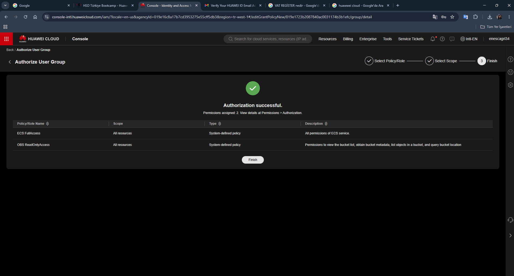

---

### 15.6 ReadOnly Group Policy Assignment

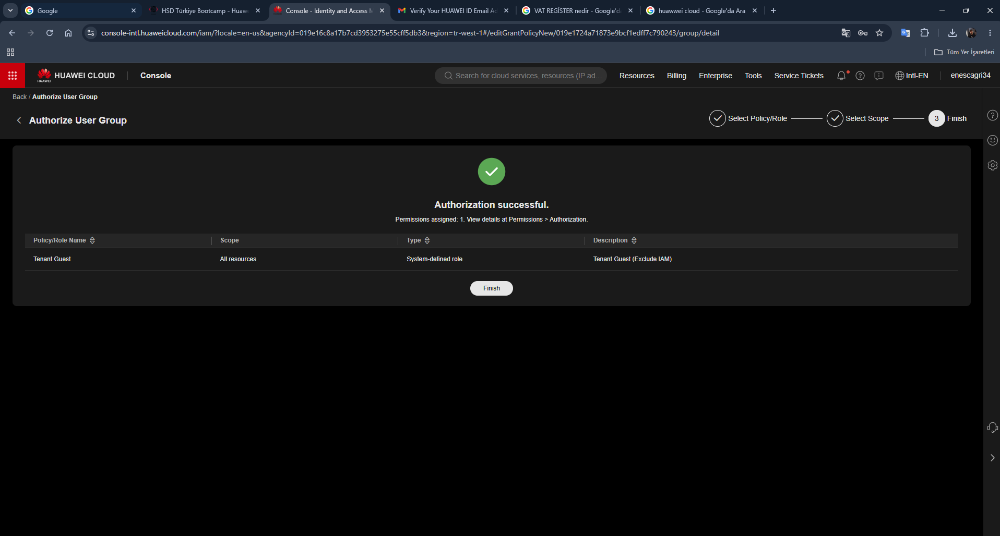

---

### 15.7 Admin User Oluşturma

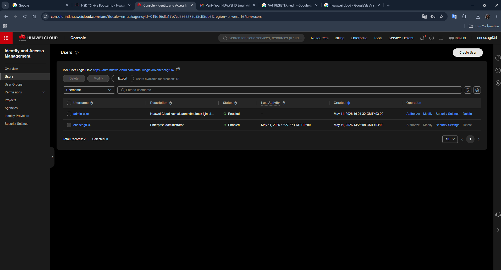

---

### 15.8 Developer User Oluşturma

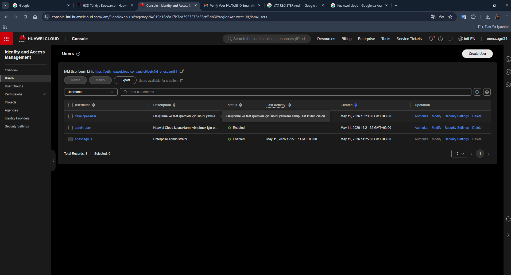

---

### 15.9 ReadOnly User Oluşturma

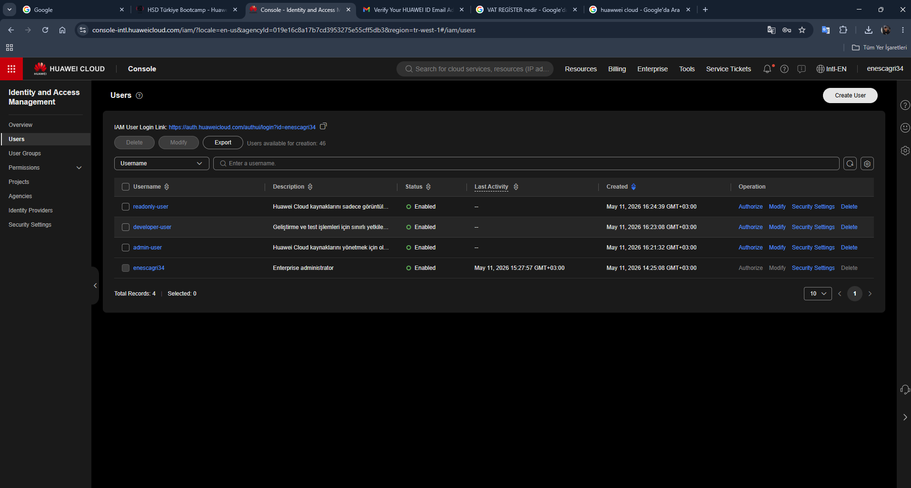

---

### 15.10 IAM User Listesi


---

### 15.11 Admin User MFA Etkinleştirme

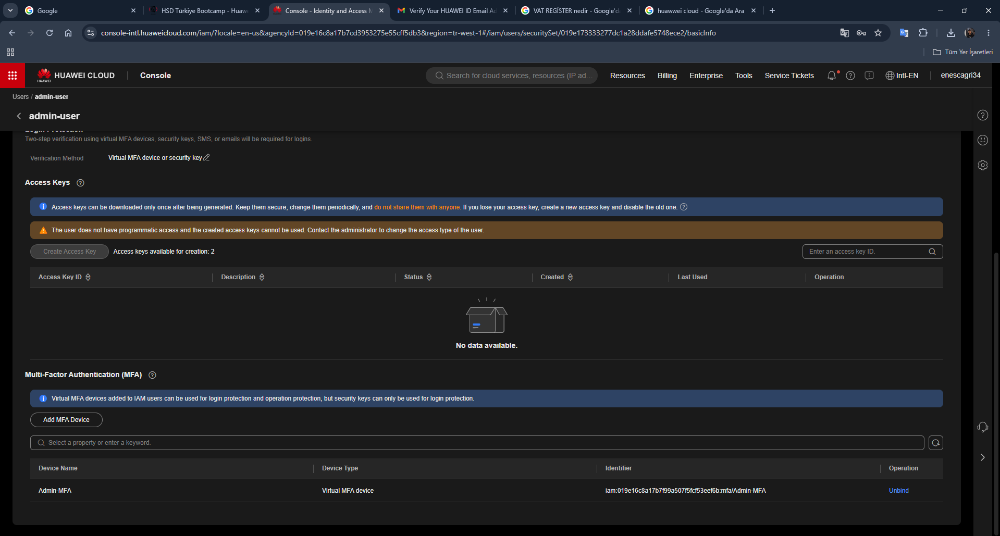

---


### 15.12 MFA ile Başarılı Giriş Testi

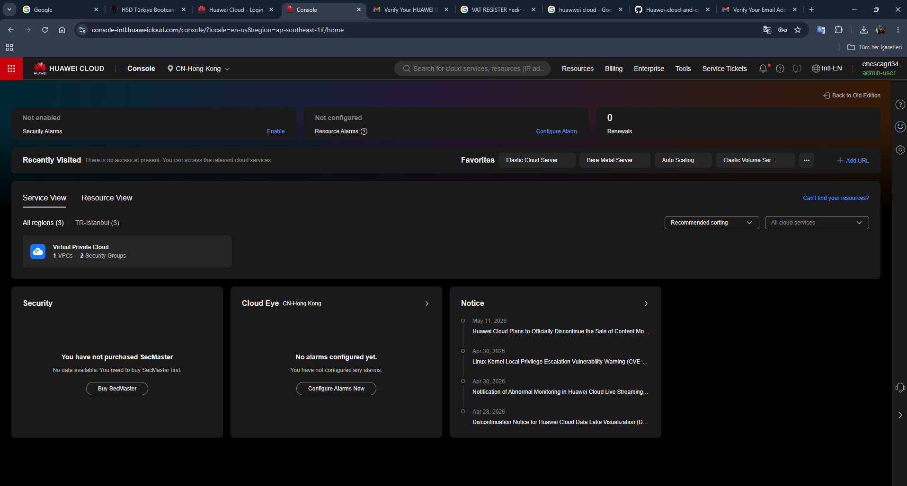

---

## 16. Güvenlik Notları

Bu çalışmada güvenlik açısından aşağıdaki noktalara dikkat edilmiştir:

- Root hesap günlük işlemlerde kullanılmamıştır.
- Kullanıcılar ayrı IAM hesaplarıyla temsil edilmiştir.
- Kullanıcılar doğrudan değil, gruplar üzerinden yetkilendirilmiştir.
- MFA etkinleştirilmiştir.
- Gereksiz access key oluşturulmamıştır.
- Hassas bilgiler ekran görüntülerinde gizlenmiştir.
- Her kullanıcıya görevine uygun erişim verilmiştir.

---

## 17. Değerlendirme

Bu çalışma sonucunda Huawei Cloud üzerinde temel bir IAM mimarisi kurulmuştur.

Kurulan yapı sayesinde:

- Farklı görevler için farklı IAM kullanıcıları oluşturulmuştur.
- Kullanıcılar gruplar üzerinden yönetilmiştir.
- Her gruba uygun policy ataması yapılmıştır.
- MFA ile hesap güvenliği güçlendirilmiştir.
- Root hesabın günlük işlemlerde kullanılmaması prensibi uygulanmıştır.
- IAM yapısı diagram ile görselleştirilmiştir.
- Yapılan işlemler ekran görüntüleriyle belgelenmiştir.

Bu yapı, cloud ortamlarında güvenli erişim yönetiminin temelini oluşturan iyi bir başlangıç örneğidir.

---

## 18. Sonuç

Bu ödev ile Huawei Cloud IAM servisinin temel özellikleri uygulamalı olarak kullanılmıştır.

Admin, Developer ve ReadOnly olmak üzere üç farklı yetki seviyesi oluşturulmuş, kullanıcılar ilgili gruplara atanmış ve MFA ile güvenlik artırılmıştır.

Çalışma boyunca özellikle şu güvenlik prensipleri uygulanmıştır:

```text
Least Privilege
MFA
Root Account Protection
Group-Based Permission Management
Separation of Duties
Accountability
```

Sonuç olarak, IAM’in cloud güvenliğinde sadece kullanıcı oluşturma aracı olmadığı; kimlik, yetki, güvenlik ve denetim süreçlerinin merkezinde yer aldığı görülmüştür.

---

## 19. Kısa Özet

Bu çalışmada:

```text
3 IAM grubu oluşturuldu.
3 IAM kullanıcısı oluşturuldu.
Kullanıcılar ilgili gruplara eklendi.
Gruplara policy atandı.
MFA aktif edildi.
MFA login testi yapıldı.
IAM diagramı hazırlandı.
Tüm süreç GitHub için dokümante edildi.
```

Bu yapı, Huawei Cloud üzerinde temel ama güvenli bir IAM organizasyonu kurmak için örnek bir çalışma niteliğindedir.